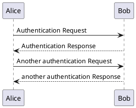
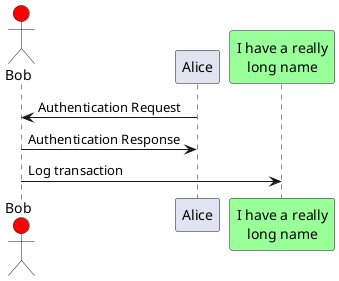
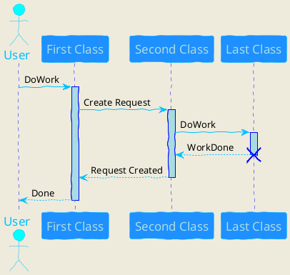

# Diagrams

## Plantuml

```plantuml
@startuml
Alice -> Bob: Authentication Request
Bob --> Alice: Authentication Response

Alice -> Bob: Another authentication Request
Alice <-- Bob: another authentication Response
@enduml
```

```plantuml
@startuml
actor Bob #red
' The only difference between actor
'and participant is the drawing
participant Alice
participant "I have a really\nlong name" as L #99FF99
/' You can also declare:
   participant L as "I have a really\nlong name"  #99FF99
  '/

Alice->Bob: Authentication Request
Bob->Alice: Authentication Response
Bob->L: Log transaction
@enduml
```

```plantuml
@startuml
skinparam backgroundColor #EEEBDC
skinparam handwritten true

skinparam sequence {
	ArrowColor DeepSkyBlue
	ActorBorderColor DeepSkyBlue
	LifeLineBorderColor blue
	LifeLineBackgroundColor #A9DCDF

	ParticipantBorderColor DeepSkyBlue
	ParticipantBackgroundColor DodgerBlue
	ParticipantFontName Impact
	ParticipantFontSize 17
	ParticipantFontColor #A9DCDF

	ActorBackgroundColor aqua
	ActorFontColor DeepSkyBlue
	ActorFontSize 17
	ActorFontName Aapex
}

actor User
participant "First Class" as A
participant "Second Class" as B
participant "Last Class" as C

User -> A: DoWork
activate A

A -> B: Create Request
activate B

B -> C: DoWork
activate C
C --> B: WorkDone
destroy C

B --> A: Request Created
deactivate B

A --> User: Done
deactivate A

@enduml
```
